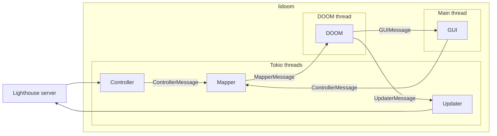

# lidoom

[](https://crates.io/crates/lidoom)
[](https://github.com/fwcd/lidoom/actions/workflows/build.yml)

DOOM port for Project Lighthouse.


## Building

To build the project, run

```sh
cargo build
```

Optionally, you can build it with a GUI. This requires SDL2, see [these instructions](https://github.com/Rust-SDL2/rust-sdl2?tab=readme-ov-file#sdl20-development-libraries). If you are running macOS and have installed SDL2 via Homebrew, you can source the following script to add the Homebrew-provided SDL2 to your library path:

```sh
source ./buildenv.sh
```

Then build the project with the `gui` flag:

```sh
cargo build --features gui
```

> [!TIP]
> If you are developing with rust-analyzer in VSCode, add the following to your `.vscode/settings.json` to enable language support in the GUI module:
> ```json
> {
>   "rust-analyzer.cargo.features": ["gui"]
> }
> ```

## Running

Make sure to have the following environment variables set or in a `.env` file in the working directory:

```sh
LIGHTHOUSE_USER=<your user>
LIGHTHOUSE_TOKEN=<your token>
```

Additionally, make sure that your working directory contains a DOOM WAD (e.g. `DOOM1.WAD`), which you need to obtain externally, then run

```sh
cargo run
```

> Optionally, use `--features gui` here too.

## Input

The game can take input both via the Lighthouse frontend (LUNA) and via the SDL GUI. When using the Lighthouse frontend, make sure to leave "Legacy Mode" unchecked.

## Architecture

Internally, lidoom uses a number of threads and virtual threads (Tokio tasks) to communicate. This architecture allows for robust bridging between blocking contexts (e.g. the SDL GUI on the main thread or DOOM, which runs on its own thread) and Tokio's async tasks (for the communication with the lighthouse server). Graphically, the architecture can be visualized as follows:


